# Storytelling

Entre 2021 e 2023, milhares de acidentes de trânsito foram registrados em Nova York. Este projeto busca entender os padrões por trás desses eventos: quando e por que eles acontecem com mais frequência? Com uma abordagem clara e visual, nosso objetivo é transformar os dados em respostas acessíveis para qualquer pessoa interessada no tema, incluindo profissionais da área de segurança, gestão urbana e análise de dados.

## Fonte dos Dados

Os dados foram obtidos do NYC Open Data e contêm informações sobre todos os acidentes de trânsito ocorridos na cidade de Nova York entre janeiro de 2021 e abril de 2023. As variáveis incluem data, hora, localização, fatores contribuintes, tipo de usuário afetado (pedestre, ciclista, motorista), número de feridos e mortos.

## Análise recomendada

- Compare a % do total de acidentes por mês. Você percebe algum padrão sazonal?

- Divida a frequência de acidentes por dia da semana e hora do dia. Com base nesses dados, quando os acidentes ocorrem com mais frequência?

- Em qual rua em particular foram relatados mais acidentes? O que isso representa como % de todos os acidentes relatados?

- Qual foi o fator contribuinte mais comum para os acidentes relatados? E quanto a acidentes fatais especificamente?

**Observação:**

- Ao longo da análise outros tipos de perguntas de negócio foram surgindo que resultaram na soma do projeto como um todo. Dividimos em etapas toda a análise, `data_cleaning`, `temporal`, `geographic`, `contribuing_factors` e `advanced_analysis`

## Tratamento de Dados

Antes de qualquer análise, é essencial garantir que os dados estejam limpos, organizados e prontos para uso. Dados com valores ausentes, formatos inconsistentes ou informações irrelevantes podem comprometer a qualidade da análise e levar a conclusões incorretas.

Nesta etapa, aplicamos um processo de tratamento focado na clareza, coerência e integridade dos dados. A seguir, explicamos de forma simples e direta quais decisões foram tomadas e por quê.

### Diagnóstico Inicial

O dataset original contém 238.421 registros e 18 colunas. Algumas dessas colunas apresentavam valores nulos. Para lidar com esses casos, adotamos um critério baseado na proporção de dados ausentes, conforme a tabela:

| Percentual de Nulos | Recomendação Geral |
|---------------------|--------------------|
| < 5%                | Pode manter e preencher (ex: com "Unknown", média, zero etc.) |
| 5% – 30%            | Avaliar com cuidado. Se for uma coluna importante, preencher. Se for irrelevante, pode remover. |
| > 30% – 50%         | Tendência a descartar, a menos que a variável seja muito relevante |
| > 50%               | Normalmente descartada, a menos que seja fundamental e não possa ser obtida de outra forma |

Com base nesse critério, analisamos individualmente as colunas com nulos e tomamos decisões alinhadas ao propósito do projeto.

#### Coluna: Cross Street

- Problema identificado: 53,32% dos registros estavam vazios.

- Impacto: A ausência de mais da metade dos dados compromete qualquer análise baseada nessa coluna.

- Decisão: Remoção da coluna. Temos outras variáveis com melhor cobertura e precisão para localização, como Street Name, Borough, Latitude e Longitude.

#### Coluna: Borough

- Problema identificado: 3,02% de registros sem bairro informado.

- Por que não inferimos: O nome da rua, por si só, não é suficiente para determinar o bairro com precisão, já que ruas podem atravessar múltiplos bairros. Sem número, interseção ou CEP, não é possível localizar com confiança.

- Decisão: Remoção dos registros com valores ausentes, garantindo consistência nas análises de localização. O impacto na base é pequeno e a confiabilidade dos dados restantes aumenta.

#### Coluna: Contributing Factor

- Problema identificado: 0,54% dos registros sem causa informada.

- Decisão: Preenchimento com o valor "Unknown". Como o volume de ausências é muito pequeno, a escolha evita perda de dados úteis e mantém coerência com o restante da base. Ainda é possível incluir esses registros nas análises gerais, sem enviesar os resultados.

#### Coluna: Street Name

- Problema identificado: Apenas 0,15% de registros estavam vazios.

- Decisão: Preenchimento com "Unknown". A baixa taxa de nulos não justifica a exclusão de registros, que ainda são valiosos para outras análises. Em visualizações específicas, esses registros podem ser filtrados.

#### Colunas: Latitude e Longitude

- Problema identificado: Cerca de 9,36% dos registros não possuem coordenadas geográficas.

- Decisão: Manutenção desses registros. Apesar da ausência de localização geográfica, os dados ainda são relevantes para outras análises. As coordenadas serão filtradas apenas em visualizações que exigem geolocalização, como mapas.

#### Crição de Novas Colunas

Criamos novas colunas derivadas a partir de `Time` para facilitar as análises a seguir. `Year`, ``Month``, ``Month Name``, ``Day of week``, ``Day`` e ``Season``

#### Dataset Após Tratamento

Após a etapa de tratamento, o dataset foi reduzido para 231.223 registros e 23 colunas. A coluna Cross Street foi removida, e os registros sem bairro foram descartados. Também houve ajustes de tipos de dados, como a conversão da coluna Date para o formato datetime. E a criação de novas colunas derivadas.

---

## Análise dos Acidentes de Trânsito em Nova York: Padrões e Impacto

Esta análise explora os dados de acidentes de trânsito na cidade de Nova York para identificar padrões de ocorrência, entender as causas e dimensionar o impacto humano, utilizando informações de 2021 a 2022 para médias anuais e dados gerais para outras proporções.

### Quando Acontecem Mais Acidentes?

**Pergunta de Negócio:** Compare a % do total de acidentes por mês. Você percebe algum padrão sazonal?

A análise dos dados temporais revela períodos de maior risco e padrões sazonais claros:

- **Meses:** Março se destaca como o mês com a maior proporção de acidentes (10,52% do total), seguido de perto por janeiro (9,69%) e fevereiro (8,93%). A concentração de acidentes no primeiro trimestre do ano (janeiro, fevereiro e março) soma quase 30% do total anual. Isso sugere que condições climáticas adversas como neve, gelo e chuva, comuns nesses meses, contribuem significativamente para o aumento das ocorrências.

  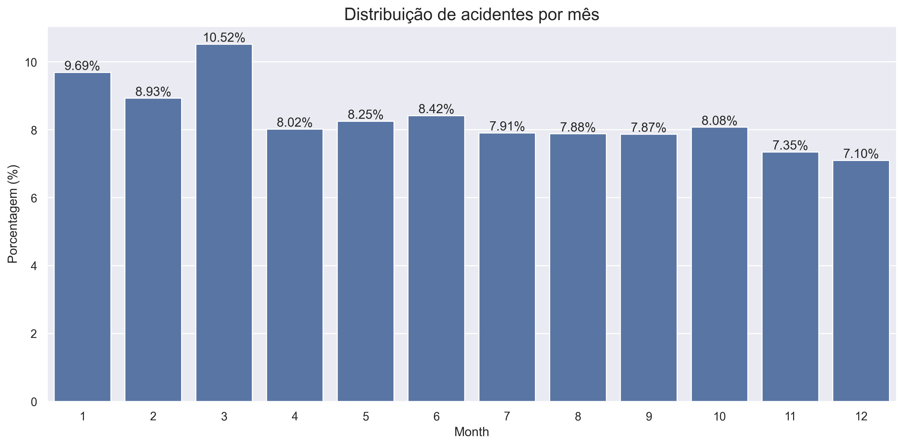

- **Estações:** A primavera lidera com 26,79% dos acidentes, seguida pelo inverno com 25,72%. O inverno, pelas condições de pista, e a primavera, possivelmente pelo aumento do volume de tráfego e mudanças climáticas, apresentam os maiores desafios. Claramente, há um padrão sazonal, com o inverno e o início da primavera concentrando a maior frequência de acidentes.

  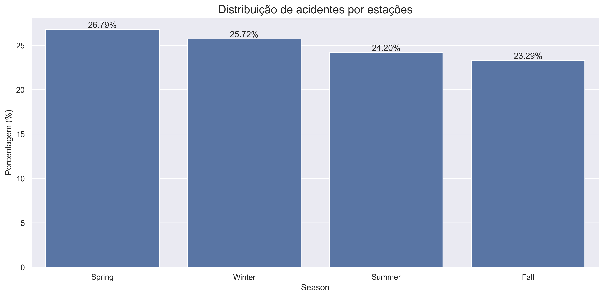

**Padrões Sazonais por Tipo de Veículo:**

Analisando a distribuição de acidentes por tipo de veículo em cada mês do ano, identificamos padrões sazonais específicos:

  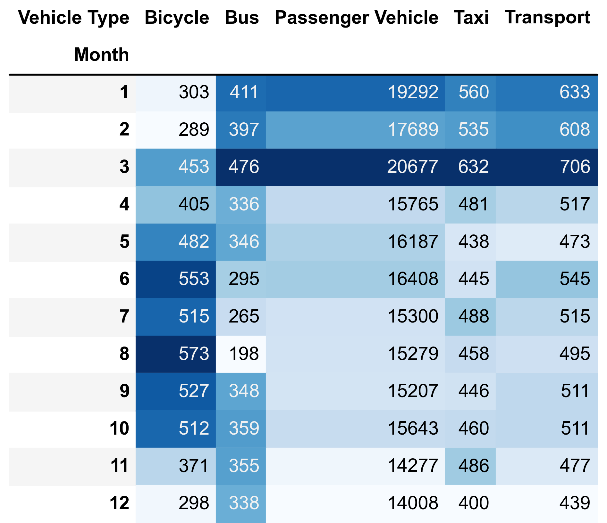

- **Veículos de Passageiros:** Dominam amplamente as estatísticas em todos os meses, com pico em março (20.677 acidentes). O primeiro trimestre do ano apresenta números significativamente mais altos. Há uma redução notável a partir de abril, que se mantém mais estável durante o resto do ano.

- **Bicicletas:** Mostram um padrão sazonal claro, com números mais baixos nos meses de inverno (fevereiro: 289, dezembro: 298) e quase o dobro de acidentes nos meses mais quentes, com pico em agosto (573). Isso reflete o aumento natural de ciclistas nas ruas durante a primavera e o verão.

- **Ônibus:** Apresentam tendência oposta às bicicletas, com mais acidentes nos meses frios (março: 476, janeiro: 411) e uma queda significativa no verão, atingindo o mínimo em agosto (198). Isto pode estar relacionado às férias escolares e redução no número de rotas ou frequência.

- **Táxis:** Mantêm uma distribuição mais estável ao longo do ano, com pequena concentração nos primeiros meses, especialmente março (632). A flutuação é menor comparada a outros tipos de veículos.

- **Transportes:** Seguem padrão similar aos ônibus, com pico em março (706) e valores mais baixos nos meses finais do ano (dezembro: 439). Esta categoria provavelmente inclui veículos comerciais e de entrega.

  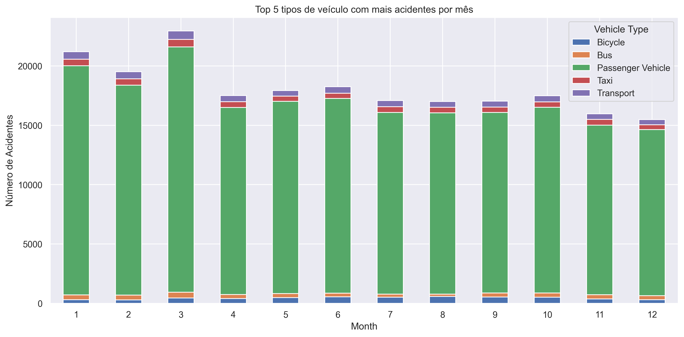

Esta análise sazonal por tipo de veículo oferece insights valiosos para campanhas de segurança viária direcionadas, sugerindo quando diferentes tipos de usuários das vias precisam de atenção especial.

### A Hora do Perigo

**Pergunta de Negócio:** Divida a frequência de acidentes por dia da semana e hora do dia. Com base nesses dados, quando os acidentes ocorrem com mais frequência?

O horário e o dia da semana são fatores críticos na frequência de acidentes, permitindo identificar os períodos de maior ocorrência:

- **Dia da Semana:** A sexta-feira registra o maior número de acidentes, totalizando 15,71% das ocorrências semanais.

  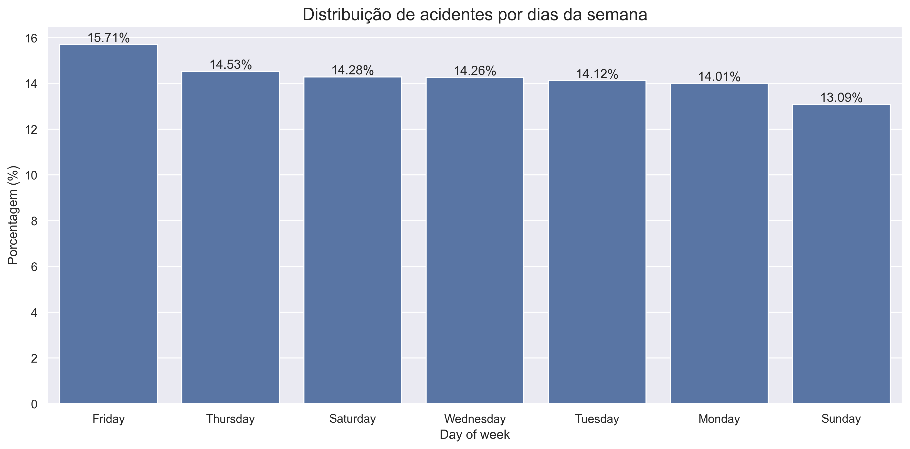

- **Horário do Dia:** O período do fim da tarde, entre 16h e 18h, concentra o pico de acidentes, respondendo por quase 20% do total. Este horário coincide com o pico do tráfego, o fim da jornada de trabalho e o cansaço dos motoristas, criando um cenário propício para colisões.

- **Madrugada:** Entre 2h e 5h da manhã, os acidentes são menos frequentes (abaixo de 2% por hora), refletindo o menor volume de tráfego. No entanto, acidentes noturnos e de madrugada tendem a ter maior gravidade.

  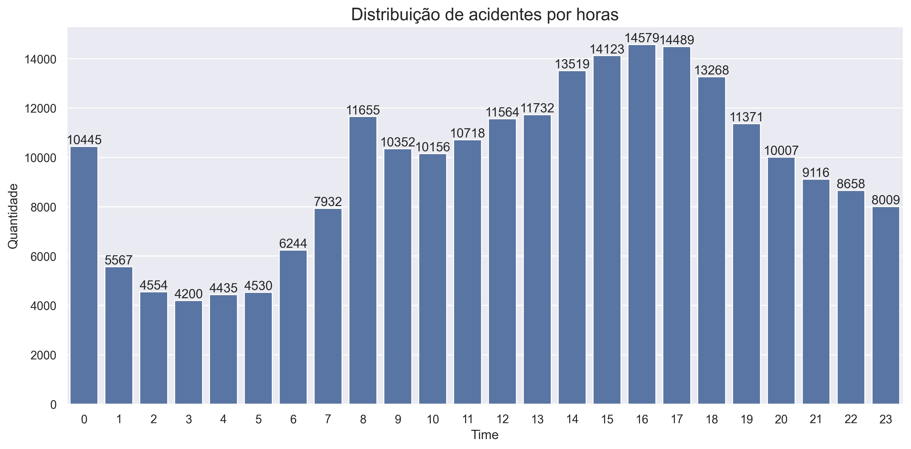

**Padrões de Acidentes por Dia e Hora (Baseado em Mapa de Calor):**

Observando a distribuição de acidentes por dia da semana e hora do dia, podemos destacar padrões claros:

- **Horários de pico nos dias úteis:** Há uma concentração significativa de acidentes entre 14h e 19h (período da tarde/noite) de segunda a sexta-feira, com o pico mais intenso ocorrendo por volta das 16h-17h.

- **Padrão matinal:** Outro período crítico acontece por volta das 8h-10h nos dias úteis, coincidindo com o horário de deslocamento para o trabalho.

- **Comportamento de fim de semana:** Sábados e domingos apresentam padrões distintos:

  - As primeiras horas da madrugada (0h-1h) mostram concentrações elevadas, provavelmente relacionadas à vida noturna.

  - Os horários de pico durante o dia são menos pronunciados e há uma distribuição mais homogênea ao longo do dia comparado aos dias úteis.

- **Período noturno:** De forma geral, a quantidade de acidentes reduz drasticamente durante a madrugada (2h-5h) em todos os dias da semana.

  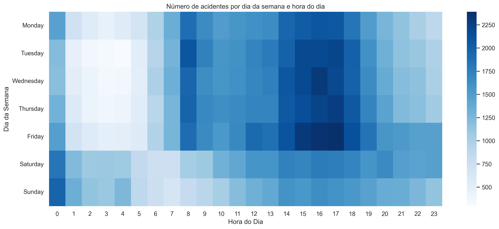

Com base nesses dados, os acidentes ocorrem com mais frequência no **fim da tarde de sexta-feira**, com picos gerais nos horários de pico de tráfego durante os dias úteis.

### Lugares para Redobrar a Atenção

**Pergunta de Negócio:** Em qual rua em particular foram relatados mais acidentes? O que isso representa como % de todos os acidentes relatados?

A distribuição geográfica dos acidentes não é uniforme, com alguns distritos e vias apresentando maior concentração de ocorrências:

- **Distritos:** Brooklyn e Queens são os distritos com o maior número de acidentes, concentrando 33,05% e 27,57% do total, respectivamente. Juntos, somam mais de 60% das ocorrências na cidade.

  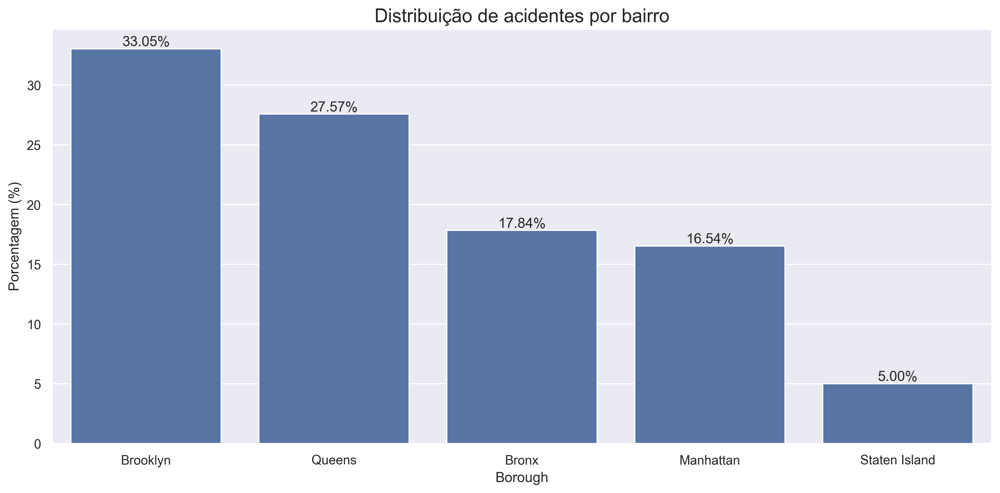

- **Vias Críticas:** Algumas vias específicas se destacam por seu alto volume de acidentes:

  - **Belt Parkway** é a rua em particular com mais acidentes relatados: 1,47% de todos os acidentes da cidade.

  - **Broadway:** 1,18%

  - **Atlantic Avenue:** 0,94%

    Apenas dez ruas na cidade de Nova York são palco de quase 10% de todos os acidentes.

  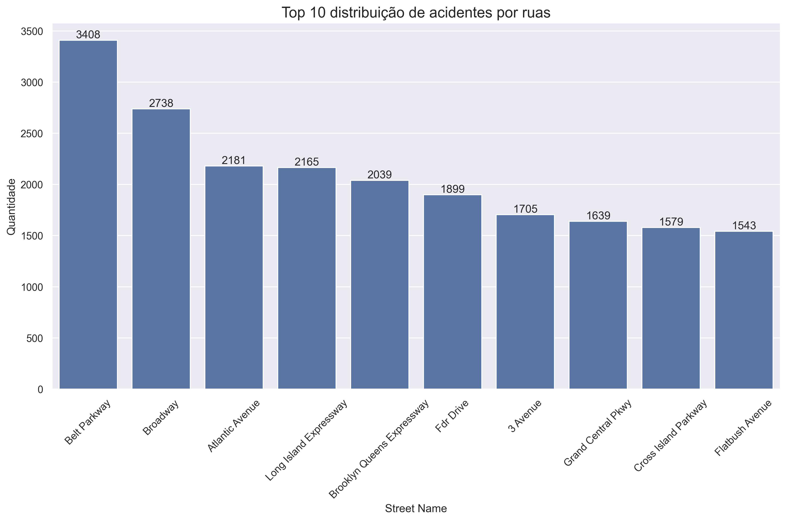

### Por Que Acontecem Tantos Acidentes?

**Pergunta de Negócio:** Qual foi o fator contribuinte mais comum para os acidentes relatados? E quanto a acidentes fatais especificamente?

A análise das causas aponta para fatores comportamentais e de investigação.

  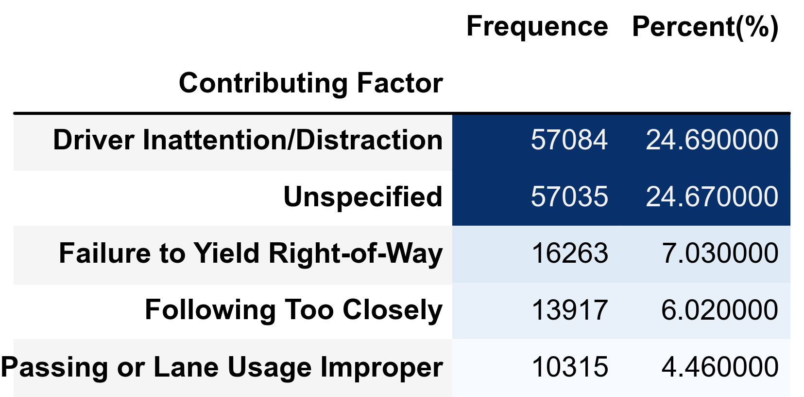

- **Causas Principais (Geral):** A **distração do motorista** é o fator contribuinte mais comum para os acidentes relatados, responsável por 24,69% do total.
- **Dados Não Especificados:** Um volume quase igual de acidentes (24,67%) é classificado com causa "não especificada", o que pode indicar desafios na coleta de dados ou na profundidade das investigações.
- **Outras Causas Comuns:** Não ceder o direito de passagem (7,03%) e seguir muito perto do veículo da frente (6,02%) são também causas frequentes em acidentes em geral.
- **Veículos Envolvidos (Geral):** Carros de passeio estão envolvidos na vasta maioria dos acidentes (84,65%), o que é esperado dada sua prevalência nas ruas.

**Fatores Contribuintes por Hora do Dia:**

Analisando os dados sobre os fatores contribuintes para acidentes por hora do dia, podemos identificar padrões que reforçam os períodos de maior risco:

- **Desatenção/Distração do Motorista:** Este é o principal fator em todas as horas do dia, com picos expressivos entre 14h e 18h. O maior número ocorre às 16h, com 3.724 casos. Este fator aumenta progressivamente durante o dia, sugerindo que o cansaço acumulado pode intensificar a desatenção.
- **Fatores Não Especificados:** Mantêm-se consistentemente como o segundo maior contribuinte. Os picos também acontecem no período da tarde, com máximo às 16h (3.601 casos). Embora não identifiquem causas específicas, estes números significativos indicam a necessidade de melhorar os relatórios de acidentes.
- **Falha em Ceder o Direito de Passagem:** Atinge seu ápice às 17h (1.252 casos), relevante nos horários de pico.
- **Seguir Muito Próximo:** Maior incidência às 17h (1.005 casos), perigoso em congestionamentos.
- **Uso Inadequado de Faixa ou Ultrapassagem:** Pico às 17h (686 casos), refletindo impaciência.

  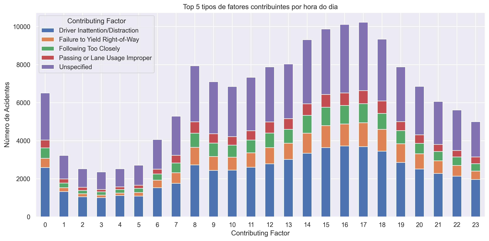

Estes dados revelam claramente que os períodos da tarde, especialmente entre 15h e 18h, são os mais críticos para acidentes em geral, impulsionados principalmente pela desatenção e comportamentos relacionados ao tráfego intenso.

**Fatores Contribuintes em Acidentes Fatais:**

Focando especificamente nos acidentes que resultaram em fatalidades, os fatores contribuintes mais comuns revelam um panorama diferente da média geral:

- O fator mais frequente em acidentes fatais é **Unspecified** (Não Especificado), presente em 327 casos. Isso reforça a necessidade de investigações mais detalhadas para entender a causa real dessas tragédias.

- Em segundo lugar, com 274 casos, está **Unsafe Speed** (Velocidade Insegura). Isso sublinha o risco mortal associado ao excesso de velocidade.

- **Driver Inattention/Distraction** (Desatenção/Distração do Motorista), embora seja a causa mais comum em acidentes gerais, aparece como o terceiro fator mais frequente em acidentes fatais, com 143 casos.

- Outros fatores notáveis em acidentes fatais incluem **Failure to Yield Right-of-Way** (Falha em Ceder o Direito de Passagem - 90 casos), **Traffic Control Disregarded** (Sinalização de Trânsito Desrespeitada - 67 casos) e **Alcohol Involvement** (Envolvimento com Álcool - 46 casos).

  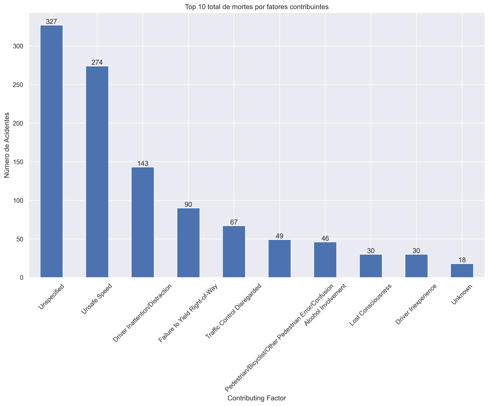

Estes dados mostram que, enquanto a distração é o problema mais disseminado no trânsito, a **velocidade insegura** e o **desrespeito às regras** (como sinalização e direito de passagem) desempenham um papel mais proeminente nas colisões com consequências mais trágicas. A alta contagem em "Não Especificado" para acidentes fatais sugere que há lacunas significativas na compreensão completa do que leva a essas perdas de vida.

### O Lado Humano das Estatísticas

Além dos números de acidentes, é crucial olhar para o impacto nas pessoas:

- **Acidentes sem Feridos:** Felizmente, 63,49% dos acidentes não resultam em ferimentos.

- **Acidentes com Feridos:** 28,62% dos acidentes resultam em um ferido, e 5,32% em dois feridos.

- **Acidentes Fatais:** Acidentes com pelo menos uma fatalidade representam 0,26% do total, cada um significando uma perda trágica.

    

        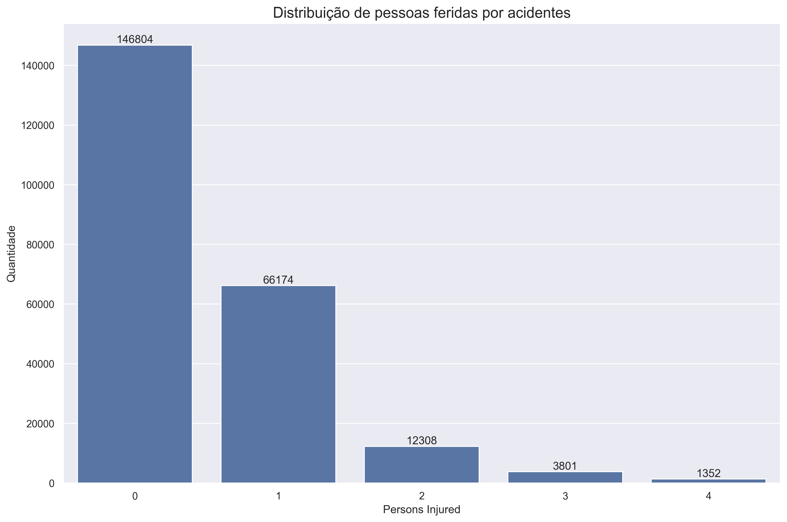
    

    

        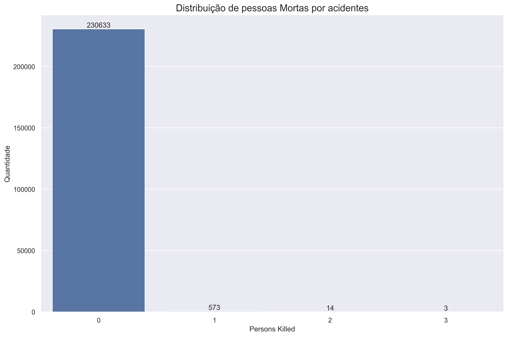
    

**Impacto em Motoristas e Passageiros:**

Observando os dados especificamente para motoristas e ocupantes de veículos, que representam a maior parte dos envolvidos:

- **Motoristas e passageiros feridos:** Diferente dos pedestres e ciclistas, este grupo apresenta números mais significativos de feridos por acidente envolvido. Em 77,51% dos acidentes com veículos, ninguém se feriu dentro deles. Contudo, 15,24% dos casos registraram uma pessoa ferida e 4,77% resultaram em dois feridos. A proporção de acidentes diminui conforme aumenta o número de feridos, mas há casos com múltiplos feridos (chegando a 40 pessoas, possivelmente em acidentes com veículos de transporte coletivo).

- **Motoristas e passageiros fatalmente atingidos:** Apesar do maior envolvimento geral, as fatalidades de ocupantes são raras. Em 99,9% dos acidentes, não houve mortes de ocupantes de veículos. Apenas 0,1% dos acidentes (equivalente a 225 casos) resultaram em uma morte de ocupante, 10 acidentes registraram duas mortes, e somente 3 casos tiveram três vítimas fatais.

    

        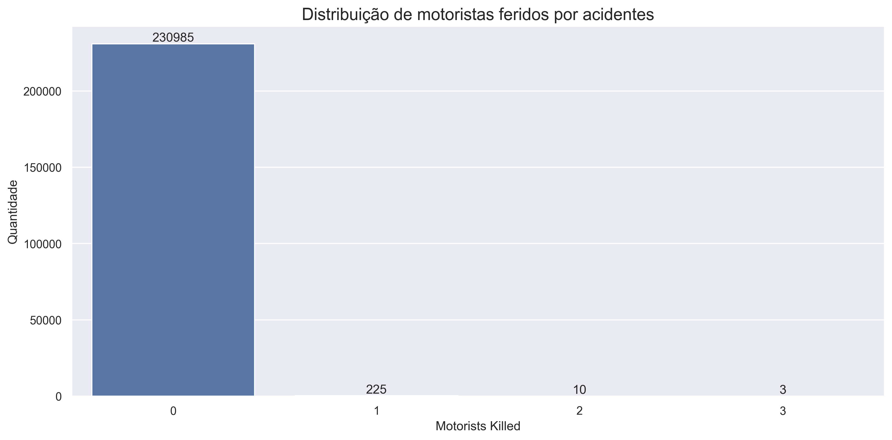
    

    

        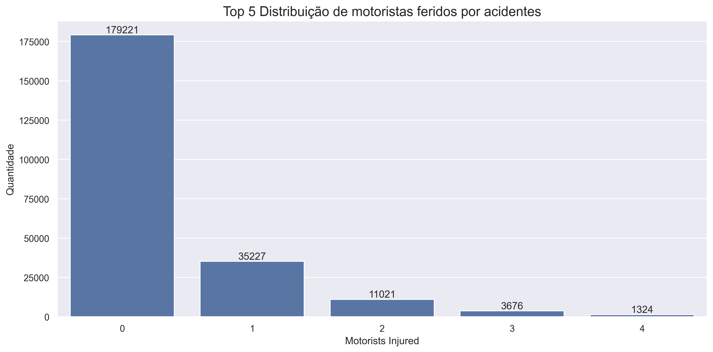
    

Estes dados mostram que, embora os ocupantes de veículos representem o maior grupo de feridos em acidentes, a taxa de sobrevivência é alta. Isso provavelmente reflete a eficácia dos dispositivos de segurança nos veículos modernos, como cintos, airbags e estruturas projetadas para absorver impactos, transformando o que poderia ser um acidente fatal em um incidente com ferimentos não letais.

**Analisando a média anual dos anos de 2021 e 2022 (período completo):**

- **Total de Pessoas Feridas:** Em média, 50.065,5 pessoas foram feridas anualmente, o que corresponde a aproximadamente 24,09% do total de acidentes.

- **Total de Pessoas Mortas:** Em média, 278,0 pessoas perderam a vida anualmente, cerca de 0,13% dos acidentes.

Detalhando por tipo de usuário da via:

- **Pedestres:** Média de 8.118,5 feridos (3,91% dos acidentes) e 127,0 mortos (0,06% dos acidentes) anualmente.

- **Ciclistas:** Média de 4.878,0 feridos (2,35% dos acidentes) e 17,5 mortos (0,01% dos acidentes) anualmente.

- **Motoristas (e Ocupantes):** Média de 34.852,0 feridos (16,77% dos acidentes) e 117,5 mortos (0,06% dos acidentes) anualmente.

Estes dados médios reforçam a escala do impacto humano dos acidentes de trânsito em Nova York, mostrando que dezenas de milhares de pessoas se ferem e centenas morrem nas vias da cidade a cada ano, com motoristas e ocupantes sendo o grupo com maior volume de feridos, mas com menor proporção de fatalidades por acidente envolvido em comparação com pedestres e ciclistas.

### O Que Podemos Aprender e Como Agir?

A compreensão desses padrões é fundamental para melhorar a segurança no trânsito:

- **Planejamento Consciente:** Estar ciente dos horários (fim da tarde de sexta-feira, horários de pico nos dias úteis) e locais de maior risco (Brooklyn, Queens, vias específicas como a Belt Parkway) pode ajudar motoristas, ciclistas e pedestres a planejar seus deslocamentos com maior cautela. Os dados do mapa de calor e das causas por hora reforçam a necessidade de atenção redobrada nos horários de pico da manhã e tarde.

- **Atenção às Condições:** Redobrar a atenção durante os meses de inverno e primavera, quando as condições da pista e o clima são mais desafiadores. A análise sazonal por tipo de veículo destaca a necessidade de atenção diferenciada para ciclistas na primavera/verão e para veículos de passageiros/transporte no início do ano.

- **Foco Total na Direção:** A distração do motorista é consistentemente a principal causa, especialmente nos horários de pico da tarde. Evitar o uso do celular e outras fontes de distração ao dirigir é vital.

- **Vulnerabilidade de Pedestres e Ciclistas:** Dada a proporção de feridos e mortos entre pedestres e ciclistas, é essencial que todos os usuários da via estejam atentos à presença uns dos outros, especialmente em áreas de alto tráfego e nos distritos com mais acidentes. Embora motoristas e ocupantes sejam a maioria dos feridos, pedestres e ciclistas têm maior risco proporcional de lesões graves ou fatais ao se envolverem em um acidente.

- **Direcionamento de Ações:** As autoridades de trânsito podem usar esses dados para focar recursos em horários, locais e causas mais problemáticas, além de investigar mais a fundo as causas não especificadas para obter um panorama mais completo. A análise das médias de feridos e mortos por tipo de usuário da via e os padrões por tipo de veículo e hora do dia podem direcionar ações de segurança mais eficazes e focadas.

Conhecer estes padrões e o impacto real nas vidas das pessoas é o primeiro passo para promover um comportamento mais seguro e para que as autoridades implementem medidas eficazes, visando reduzir o número de acidentes, ferimentos e fatalidades nas ruas de Nova York.
